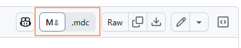

# Render Cursor Rules as Markdown on GitHub

This UserScript renders Cursor Rules (`*.mdc`) markdown on GitHub into actual Markdown.

## Installation

1. Install [Tampermonkey](https://www.tampermonkey.net/) or [Greasemonkey](https://www.greasespot.net/)
2. Install the script from [GreasyFork](https://greasyfork.org/en/scripts/537391-cursor-rule-markdown-renderer-for-github)
3. Enjoy GitHub rendering Cursor Rules as Markdown!

There will be a little toggle button in the top right of the page that allows you to switch between the rendered and source views:

## Notes

1. Uses the [marked](https://github.com/markedjs/marked) library to render the markdown, `@require`'d by *monkey from the CDN.
    - includes the [marked-footnote](https://github.com/bent10/marked-extensions/tree/main/packages/footnote) extension to render footnotes.
2. Uses the [highlight.js](https://github.com/highlightjs/highlight.js) library to syntax highlight code blocks.
3. Bakes in some CSS to make the markdown look like GitHub's default markdown; may differ slightly from "normal" GitHub markdown.
4. This **will** add some overhead to your GitHub browsing experience.
